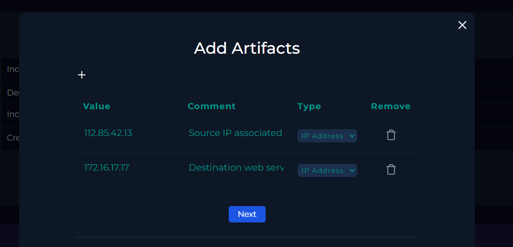

# Case #2 – JavaScript Code / Reflected XSS Investigation

## Case Overview

This investigation involved a SOC alert for JavaScript code detected within a
requested URL. The investigation was performed using the LetsDefend SOC
environment and focused on determining the attack type, source, destination,
whether the activity was malicious, and whether the attack was successful.

The investigation identified a reflected Cross-Site Scripting (XSS) attack
attempt against a public-facing web server. Log analysis showed that the
malicious request received an HTTP 302 redirect with a 0-byte response, and
no evidence of successful exploitation was identified.

---

## Alert Information

| Field | Details |
|---|---|
| Alert | SOC166 - Javascript Code Detected in Requested URL |
| Event ID | 116 |
| Severity | Medium |
| Alert Type | Web Attack |
| Hostname | WebServer1002 |
| MITRE ATT&CK | T1190 - Exploit Public-Facing Application |
| Source IP | 112.85.42.13 |
| Destination IP | 172.16.17.17 |
| HTTP Method | GET |
| Attack Type | Reflected XSS |
| Final Result | True Positive |
| Attack Outcome | Unsuccessful |

---

## Investigation Process

### 1. Alert Review

The initial alert showed JavaScript code detected within a requested URL
targeting the web server `172.16.17.17`.

The request originated from `112.85.42.13` and used the HTTP GET method.

### 2. Malicious Request Analysis

The requested URL contained a JavaScript payload within the `q` parameter:

`https://172.16.17.17/search/?q=<$script>javascript:$alert(1)</$script>`

The presence of JavaScript code in the URL indicated an attempted
Cross-Site Scripting (XSS) attack.

### 3. Log Investigation

The source IP address `112.85.42.13` was searched in Log Management.

Multiple requests from the same source IP were identified targeting
`172.16.17.17:443`, confirming repeated activity rather than a single
isolated request.

### 4. Attack Outcome Analysis

The malicious request was examined in the raw log data.

The request showed:

- Device Action: Permitted
- HTTP Method: GET
- HTTP Response Size: 0
- HTTP Response Status: 302

The HTTP 302 response indicated that the request was redirected. Combined
with the 0-byte response and the absence of evidence showing successful
payload execution, the attack was determined to be unsuccessful.

### 5. Artifact Collection

The following artifacts were documented during the investigation:

| Artifact | Type | Description |
|---|---|---|
| `112.85.42.13` | IP Address | Source IP associated with the XSS activity |
| `172.16.17.17` | IP Address | Destination web server targeted by the attack |

---

## Analyst Assessment

The investigation confirmed malicious web traffic containing an XSS payload
in the `q` parameter of a GET request.

The activity was classified as a reflected XSS attack attempt originating
from `112.85.42.13` and targeting `WebServer1002` (`172.16.17.17`).

The request received an HTTP 302 redirect with a 0-byte response, and no
evidence of successful exploitation was identified.

**Final Assessment: True Positive — Unsuccessful XSS Attack Attempt**

---

## Evidence

### 1. Initial Alert

### 2. Malicious XSS Request

### 3. Collected Artifacts

### 4. Analyst Notes

### 5. Final Case Result

---

## Skills Demonstrated

- SOC Alert Triage
- Web Attack Investigation
- Cross-Site Scripting (XSS) Analysis
- Reflected XSS Identification
- HTTP Request Analysis
- HTTP Response Analysis
- Log Management
- Source IP Investigation
- IOC / Artifact Collection
- MITRE ATT&CK Mapping
- Security Alert Documentation
- True Positive / False Positive Analysis

---

## Investigation Environment

**Platform:** LetsDefend  
**Role:** Security Analyst  
**Alert:** SOC166 - Javascript Code Detected in Requested URL  
**MITRE ATT&CK:** T1190 - Exploit Public-Facing Application
