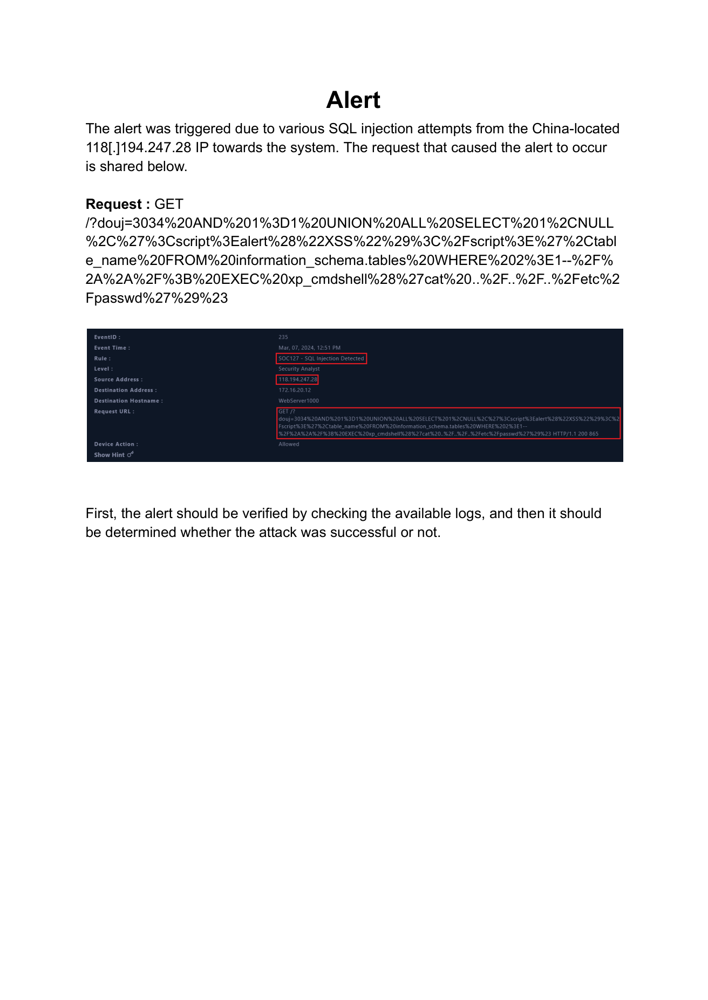
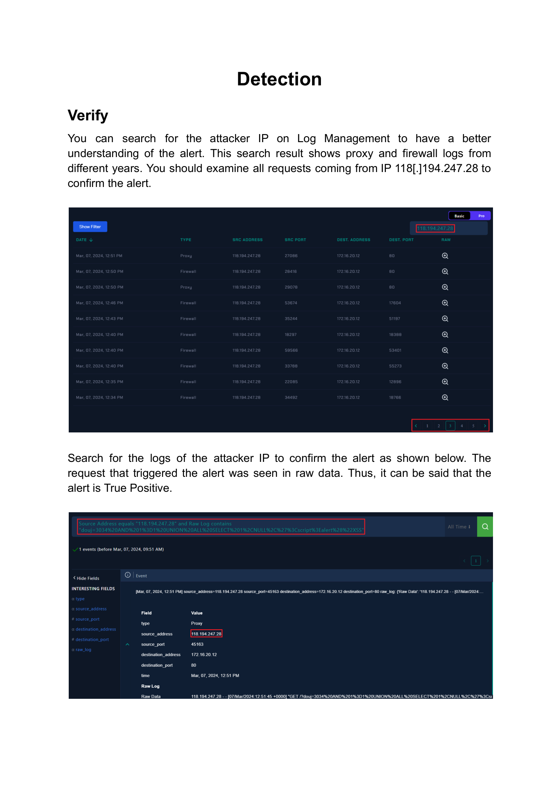
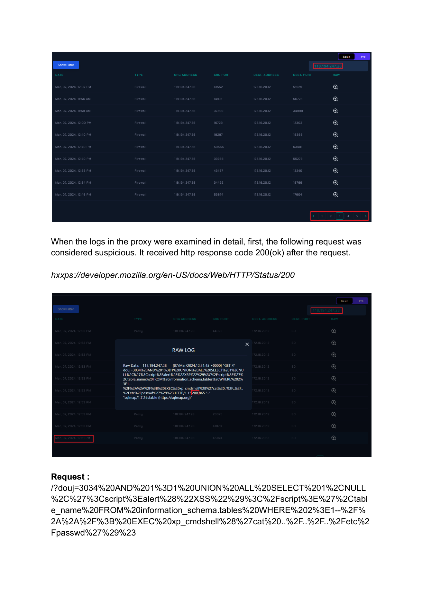
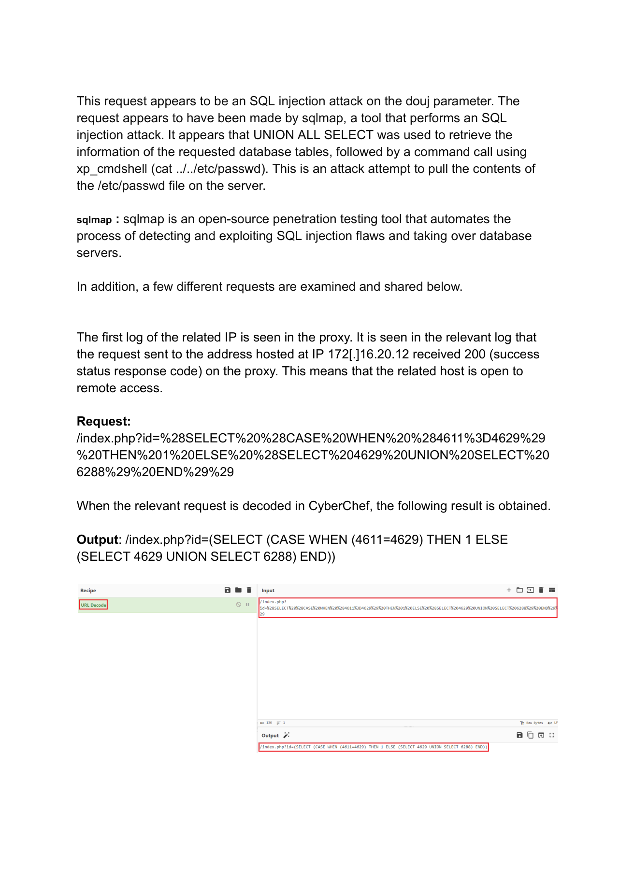
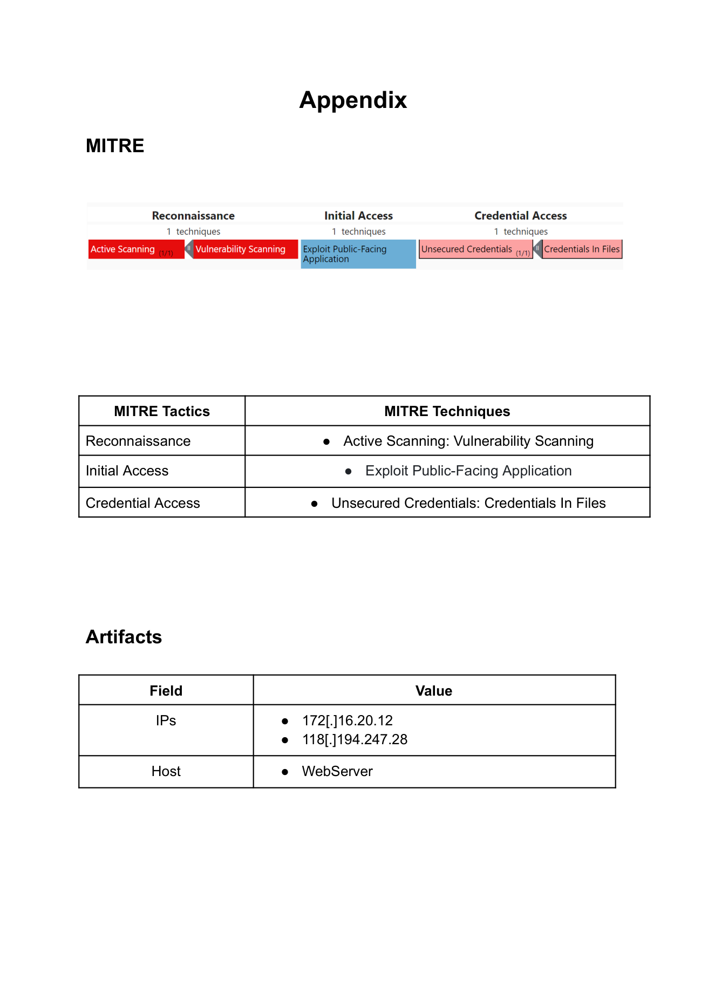

# Case #3 – SQL Injection Investigation

## Overview

This case involved a SQL injection alert generated by LetsDefend for malicious requests originating from `118.194.247.28` and targeting a web server.

The investigation focused on validating the alert, examining the attacker’s requests, identifying the SQL injection techniques used, and determining what could be concluded from the available proxy logs.

## Alert Information

| Field | Value |
|---|---|
| Event ID | 235 |
| Rule | SOC127 - SQL Injection Detected |
| Alert Type | Web Attack |
| Source IP | `118.194.247.28` |
| Target IP | `172.16.20.12` |
| Host | WebServer |
| HTTP Method | GET |
| Attack Type | SQL Injection |
| Result | True Positive |

## Investigation Process

### 1. Alert Verification

The attacker IP `118.194.247.28` was searched in Log Management. The request responsible for triggering the alert was found in the raw log data, confirming the alert as a **True Positive**.

### 2. SQL Injection Request Analysis

The suspicious request targeted the `douj` parameter and contained SQL injection syntax including `UNION ALL SELECT`, `information_schema.tables`, and `xp_cmdshell`. The payload also attempted to read `../../etc/passwd`. The report identifies the request as an SQL injection attempt and notes that it appeared to be generated using **sqlmap**.

### 3. Additional Malicious Requests

Additional requests from the same source IP included conditional SQL queries and functions such as `CASE WHEN`, `EXTRACTVALUE`, `XMLType`, and nested `SELECT` statements.

### 4. HTTP Response Analysis

The investigated requests returned HTTP `200` responses. The report explicitly states that an HTTP 200 response confirms that the server processed the HTTP request, but **does not by itself prove that the SQL injection succeeded**. Application/database logs would be required to confirm successful execution.

## MITRE ATT&CK Mapping

- **Reconnaissance:** Active Scanning / Vulnerability Scanning
- **Initial Access:** Exploit Public-Facing Application
- **Credential Access:** Unsecured Credentials / Credentials In Files

## Artifacts

| Type | Value |
|---|---|
| Source IP | `118.194.247.28` |
| Target IP | `172.16.20.12` |
| Host | `WebServer` |

## Analyst Assessment

The investigation confirmed a **True Positive SQL injection attack attempt** originating from `118.194.247.28`. The attacker sent multiple malicious SQL payloads against the web application, including attempts to enumerate database tables and invoke `xp_cmdshell`.

The available proxy evidence confirms that the malicious requests reached the target and received HTTP 200 responses. However, the HTTP status alone does not establish successful SQL injection execution. Application/database logs would be required to confirm whether the injection was successfully executed.

## Evidence

### 1. Initial Alert

### 2. Alert Verification

### 3. SQL Injection Request

### 4. SQLMap Analysis

### 5. MITRE & Artifacts

## Skills Demonstrated

- SIEM / Log Management investigation
- SQL injection analysis
- Web attack investigation
- HTTP request and response analysis
- IOC identification
- Log correlation
- MITRE ATT&CK mapping
- Security incident documentation

