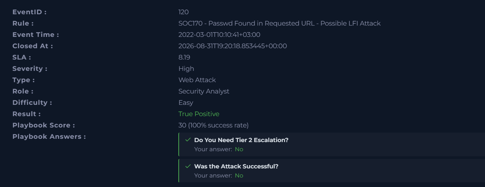
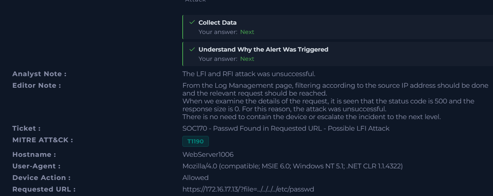
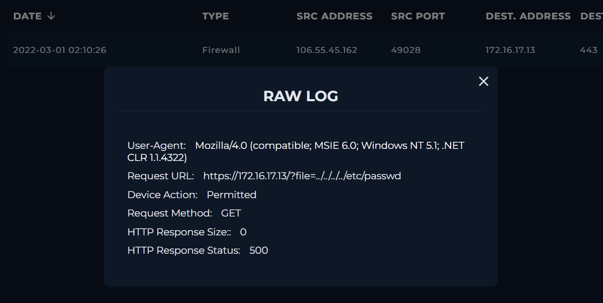
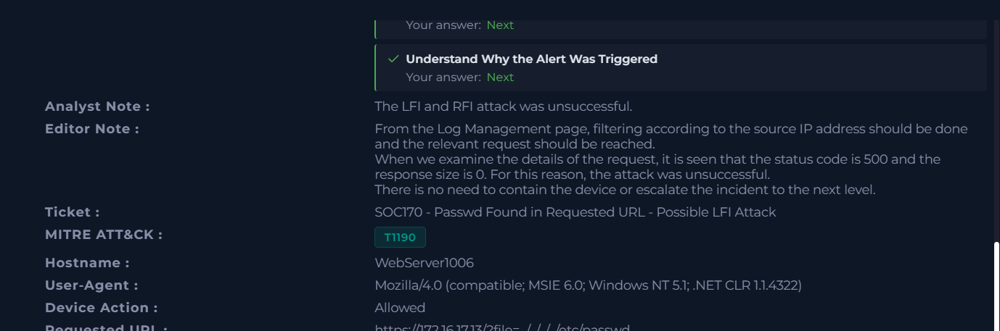

# Case #4 – LFI & RFI Investigation

## Overview

This investigation involved a web attack alert triggered by a request containing a path traversal payload targeting the `/etc/passwd` file.

The investigation focused on validating the alert, identifying the attack type, analyzing the HTTP request and response, and determining whether the attack was successful.

## Alert Information

| Field | Value |
|---|---|
| Event ID | 120 |
| Rule | SOC170 - Passwd Found in Requested URL - Possible LFI Attack |
| Severity | High |
| Alert Type | Web Attack |
| Hostname | WebServer1006 |
| Destination IP | 172.16.17.13 |
| Attack Type | LFI & RFI |
| Direction | Internet → Company Network |
| Planned Test | Not Planned |
| Traffic | Malicious |
| Result | True Positive |
| Attack Successful | No |
| MITRE ATT&CK | T1190 - Exploit Public-Facing Application |

## Investigation Process

### 1. Alert Analysis

The alert was reviewed and classified as a web attack. The requested URL contained a path traversal sequence targeting the `/etc/passwd` file:

`https://172.16.17.13/?file=../../../../etc/passwd`

The presence of the path traversal payload indicated a possible Local File Inclusion (LFI) attempt.

### 2. Attack Classification

The activity was classified as an **LFI & RFI** attack.

The request attempted to access a sensitive operating system file using directory traversal:

`../../../../etc/passwd`

The source of the traffic was external to the company network, and the activity was determined to be malicious and not part of a planned security test.

### 3. Log Analysis

The source IP was investigated through Log Management and the relevant request was examined in the raw log.

The request showed:

- HTTP Method: `GET`
- Device Action: `Permitted`
- Requested URL: `https://172.16.17.13/?file=../../../../etc/passwd`
- HTTP Response Size: `0`
- HTTP Response Status: `500`

The HTTP `500` response and 0-byte response size indicated that the request did not successfully retrieve the targeted file.

### 4. Attack Outcome

The investigation determined that the LFI/RFI attack attempt was **unsuccessful**.

No evidence of successful exploitation was identified in the available log evidence. Based on the case findings, device containment and Tier 2 escalation were not required.

## Analyst Assessment

The investigation confirmed a **True Positive LFI & RFI attack attempt** against `WebServer1006` (`172.16.17.13`).

The attacker attempted to access `/etc/passwd` through a path traversal payload. Log analysis showed that the request was permitted but returned an HTTP `500` response with a 0-byte response size. Based on this evidence, the attack was determined to be unsuccessful.

## MITRE ATT&CK

The case was mapped to:

- **T1190 – Exploit Public-Facing Application**

## Key Indicators

| Type | Value |
|---|---|
| Destination IP | `172.16.17.13` |
| Hostname | `WebServer1006` |
| Malicious Path | `../../../../etc/passwd` |
| HTTP Method | `GET` |
| Response Status | `500` |
| Response Size | `0` |

## Evidence

### 1. Initial Alert

### 2. LFI Request

### 3. Log Evidence

### 4. Analyst Assessment

### 5. Final Case Result

## Skills Demonstrated

- SIEM / Log Management investigation
- Web attack analysis
- LFI/RFI investigation
- Path traversal analysis
- HTTP request and response analysis
- IOC identification
- Incident classification
- MITRE ATT&CK mapping
- Security incident documentation
