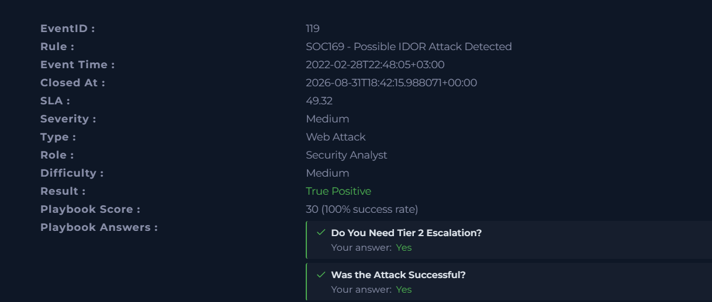
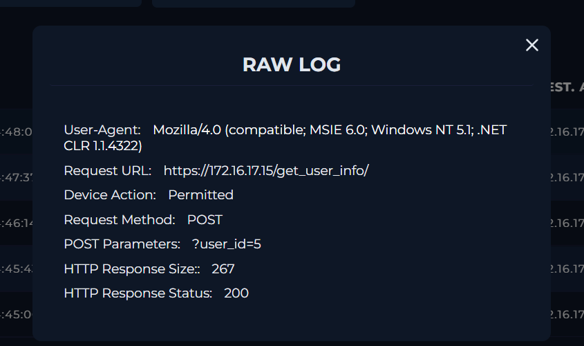
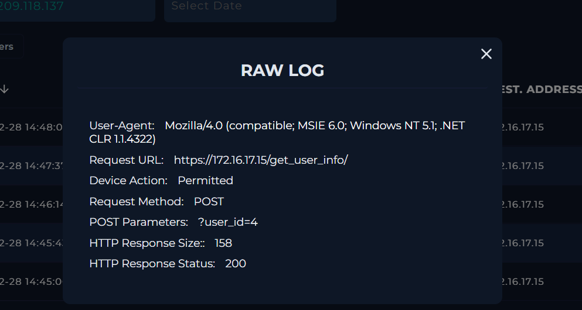
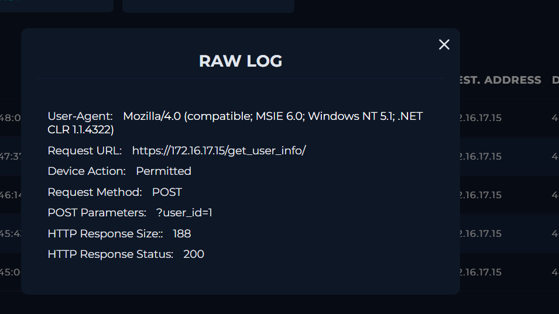
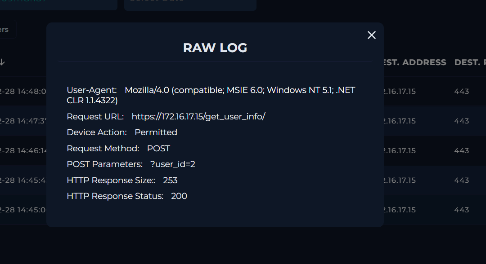
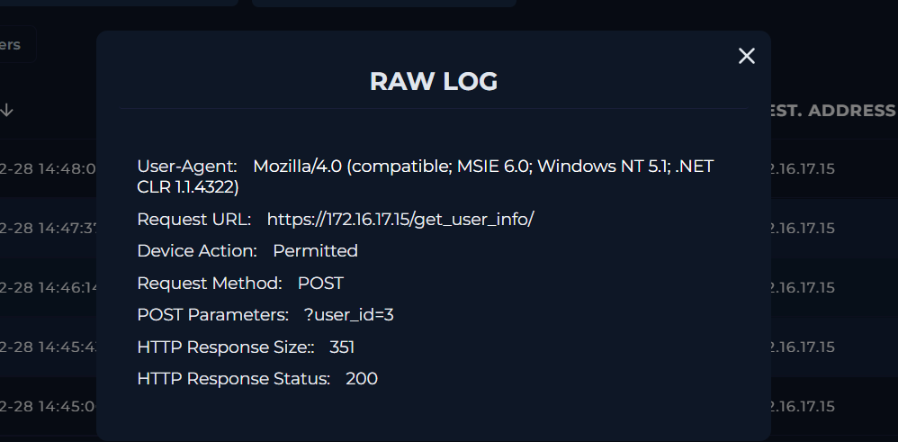
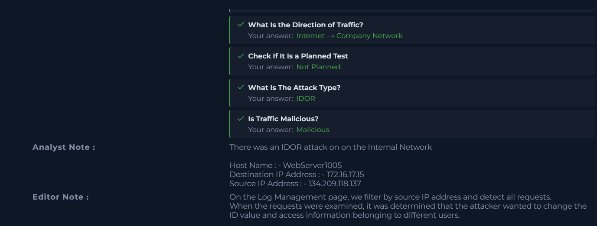
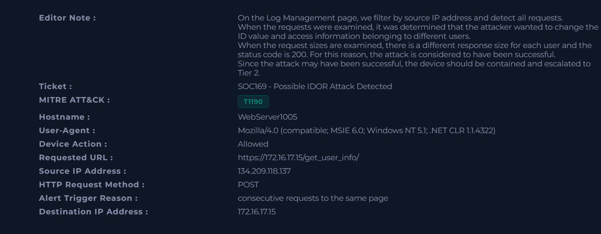

# Case #5 – IDOR Attack Investigation

## Overview

This investigation involved a web attack alert for a possible Insecure Direct Object Reference (IDOR) attack.

The investigation focused on analyzing requests to the `/get_user_info/` endpoint, identifying manipulation of the `user_id` parameter, and determining whether the attacker was able to access information associated with different users.

The investigation confirmed a True Positive IDOR attack and determined that the attack was successful.

## Alert Information

| Field | Value |
|---|---|
| Event ID | 119 |
| Rule | SOC169 - Possible IDOR Attack Detected |
| Severity | Medium |
| Alert Type | Web Attack |
| Hostname | WebServer1005 |
| Source IP | 134.209.118.137 |
| Destination IP | 172.16.17.15 |
| Attack Type | IDOR |
| Direction | Internet → Company Network |
| Planned Test | Not Planned |
| Traffic | Malicious |
| Result | True Positive |
| Attack Successful | Yes |
| Tier 2 Escalation | Yes |
| MITRE ATT&CK | T1190 - Exploit Public-Facing Application |

## Investigation Process

### 1. Alert Analysis

The alert was reviewed and identified as a possible IDOR attack against WebServer1005.

The relevant request targeted the following endpoint:

`https://172.16.17.15/get_user_info/`

The request used the POST method and the device action was recorded as Permitted.

The source IP associated with the activity was:

`134.209.118.137`

The destination IP was:

`172.16.17.15`

### 2. Attack Classification

The activity was classified as an IDOR (Insecure Direct Object Reference) attack.

The investigation found that the attacker manipulated the `user_id` parameter in requests to the `/get_user_info/` endpoint.

Examples observed during the investigation included:

`user_id=1`  
`user_id=2`  
`user_id=3`  
`user_id=4`  
`user_id=5`

The activity was identified as malicious and was not part of a planned security test.

### 3. Log Analysis

The source IP `134.209.118.137` was investigated in Log Management.

Multiple POST requests to `/get_user_info/` were identified with different `user_id` values.

The observed requests returned successful HTTP responses:

| User ID | HTTP Response Size | HTTP Status |
|---:|---:|---:|
| `1` | 188 bytes | 200 |
| `2` | 253 bytes | 200 |
| `3` | 351 bytes | 200 |
| `4` | 158 bytes | 200 |
| `5` | 267 bytes | 200 |

The requests were permitted and returned different response sizes for the different `user_id` values.

### 4. IDOR Evidence

The investigation identified multiple requests in which the `user_id` value was changed while accessing the same `/get_user_info/` endpoint.

The observed requests included:

`/get_user_info/?user_id=1`  
`/get_user_info/?user_id=2`  
`/get_user_info/?user_id=3`  
`/get_user_info/?user_id=4`  
`/get_user_info/?user_id=5`

According to the case investigation notes, the attacker attempted to change the ID value and access information belonging to different users.

The attack was determined to be successful.

## Analyst Assessment

The investigation confirmed a True Positive IDOR attack against WebServer1005 (`172.16.17.15`).

The attacker originating from `134.209.118.137` sent multiple POST requests to the `/get_user_info/` endpoint while changing the `user_id` parameter.

The requests returned HTTP 200 responses with different response sizes. The case investigation determined that the attacker was able to access information associated with different users.

The attack was classified as successful and the incident was escalated to Tier 2.

## MITRE ATT&CK

The case was mapped to:

- T1190 – Exploit Public-Facing Application

## Key Indicators

| Type | Value |
|---|---|
| Source IP | `134.209.118.137` |
| Destination IP | `172.16.17.15` |
| Hostname | `WebServer1005` |
| Endpoint | `/get_user_info/` |
| HTTP Method | `POST` |
| Attack Type | IDOR |
| MITRE ATT&CK | T1190 |

## Evidence

### 1. Initial Alert

### 2. IDOR Request – User ID 5

### 3. Log Evidence – User ID 4

### 4. Log Evidence – User ID 1

### 5. Log Evidence – User ID 2

### 6. Log Evidence – User ID 3

### 7. Analyst Assessment

### 8. Final Case Result

## Skills Demonstrated

- SIEM / Log Management investigation
- IDOR attack analysis
- Web application security investigation
- HTTP request and response analysis
- Parameter manipulation analysis
- IOC identification
- Log correlation
- Incident classification
- MITRE ATT&CK mapping
- Tier 2 escalation decision-making
- Security incident documentation
