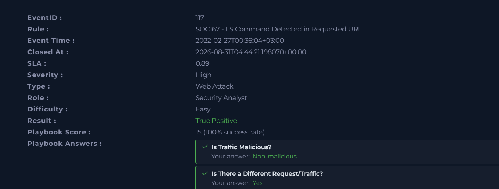
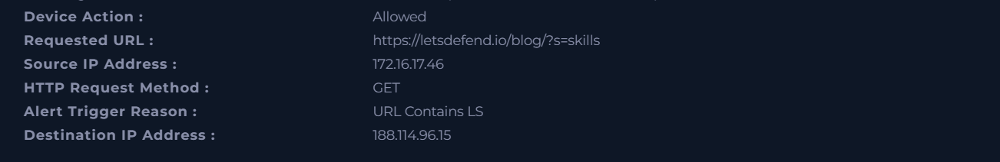
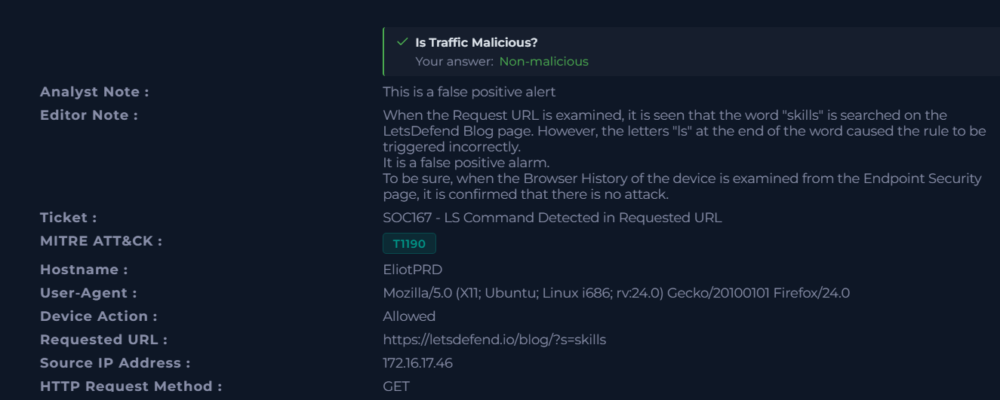
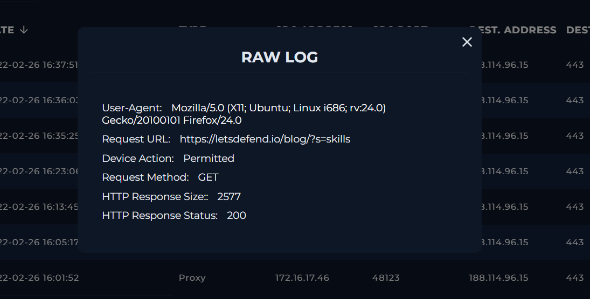
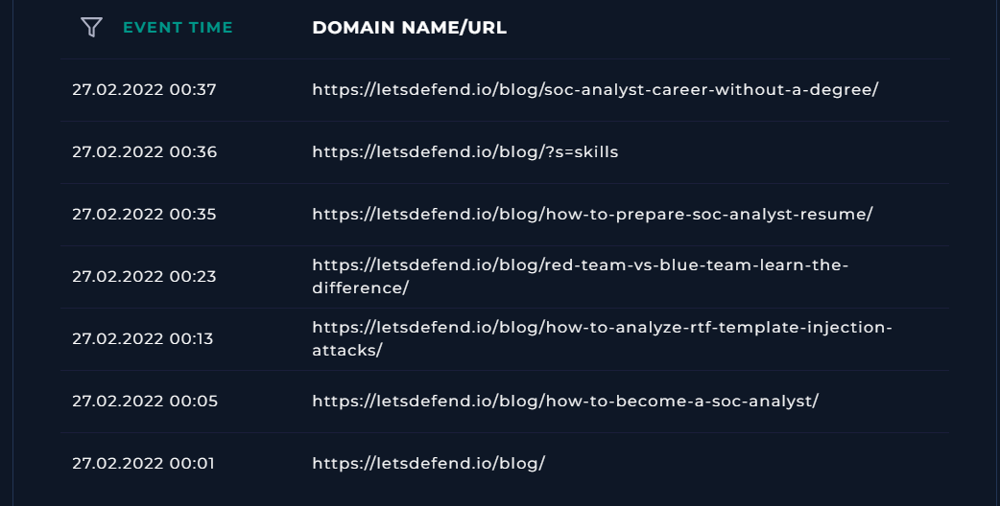

# Case #6 – LS Command Detection / False Positive Investigation

## Overview

This investigation involved a web attack alert triggered by a rule designed to detect an LS command in a requested URL.

The investigation focused on determining whether the requested URL represented a real command injection attempt or whether the detection rule had been triggered by legitimate web traffic.

The investigation determined that the traffic was non-malicious and the alert was a false positive. The letters `ls` were part of the legitimate search term `skills` in a LetsDefend blog URL, and browser history confirmed normal browsing activity.

## Alert Information

| Field | Value |
|---|---|
| Event ID | 117 |
| Rule | SOC167 - LS Command Detected in Requested URL |
| Event Time | 2022-02-27 00:36:04 +03:00 |
| Severity | High |
| Alert Type | Web Attack |
| Hostname | EliotPRD |
| Source IP | 172.16.17.46 |
| Destination IP | 188.114.96.15 |
| HTTP Method | GET |
| Device Action | Allowed |
| Requested URL | https://letsdefend.io/blog/?s=skills |
| Alert Trigger Reason | URL Contains LS |
| MITRE ATT&CK | T1190 |
| Traffic Classification | Non-malicious |
| Investigation Result | False Positive |

## Investigation Process

### 1. Alert Analysis

The alert was reviewed to determine why the SOC167 detection rule was triggered.

The requested URL was:

`https://letsdefend.io/blog/?s=skills`

The alert was triggered because the URL contained the letters `ls`.

At first glance, the detection could indicate an attempt to execute the Linux `ls` command. Therefore, the requested URL and related traffic were examined further.

### 2. Request Analysis

The request was a normal HTTP GET request to the LetsDefend blog.

The observed request contained:

- HTTP Method: `GET`
- Device Action: `Permitted`
- HTTP Response Status: `200`
- HTTP Response Size: `2577`
- Source IP: `172.16.17.46`
- Destination IP: `188.114.96.15`

The URL contained the search parameter:

`?s=skills`

The `ls` characters were part of the word `skills` rather than a command execution payload.

### 3. Log Analysis

The source IP `172.16.17.46` was investigated in Log Management.

The relevant request was identified as:

`https://letsdefend.io/blog/?s=skills`

The raw log showed that the request was permitted and returned an HTTP `200` response.

There was no evidence in the observed request of command execution, command chaining, or a malicious command injection payload.

### 4. Browser History Verification

The device browser history was examined from the Endpoint Security page.

The browser history showed the same LetsDefend URL:

`https://letsdefend.io/blog/?s=skills`

The history also contained multiple other legitimate LetsDefend blog pages, including:

- `/blog/`
- `/blog/how-to-become-a-soc-analyst/`
- `/blog/how-to-prepare-soc-analyst-resume/`
- `/blog/soc-analyst-career-without-a-degree/`
- `/blog/red-team-vs-blue-team-learn-the-difference/`

This browsing activity was consistent with normal access to LetsDefend educational content.

### 5. False Positive Determination

The detection rule incorrectly triggered because the letters `ls` appeared at the end of the word `skills`.

The investigation found no evidence that the user was attempting to execute the Linux `ls` command.

The browser history and HTTP request evidence supported the conclusion that the traffic was legitimate.

## Analyst Assessment

The alert was determined to be a **false positive**.

The SOC167 detection rule triggered because the requested URL contained the letters `ls`. However, the letters were part of the legitimate search term `skills`:

`https://letsdefend.io/blog/?s=skills`

Log analysis showed a permitted GET request with an HTTP `200` response, and browser history confirmed legitimate browsing activity on the LetsDefend website.

No evidence of command injection or malicious command execution was identified.

## MITRE ATT&CK

The alert was mapped to:

- **T1190 – Exploit Public-Facing Application**

The investigation, however, determined that the observed traffic was non-malicious.

## Key Indicators

| Type | Value |
|---|---|
| Source IP | `172.16.17.46` |
| Destination IP | `188.114.96.15` |
| Hostname | `EliotPRD` |
| Requested URL | `https://letsdefend.io/blog/?s=skills` |
| HTTP Method | `GET` |
| Device Action | `Permitted` |
| HTTP Response Status | `200` |
| HTTP Response Size | `2577` |
| Trigger Reason | `URL Contains LS` |
| Traffic Classification | `Non-malicious` |
| Final Determination | `False Positive` |

## Evidence

### 1. Initial Alert

### 2. Suspicious Request

### 3. Analyst Assessment

### 4. Log Evidence

### 5. Browser History Evidence

## Skills Demonstrated

- SIEM / Log Management investigation
- Web traffic analysis
- False positive analysis
- HTTP request and response analysis
- Browser history investigation
- Alert validation
- Detection rule analysis
- Command injection detection analysis
- Incident classification
- Security incident documentation
- MITRE ATT&CK mapping
