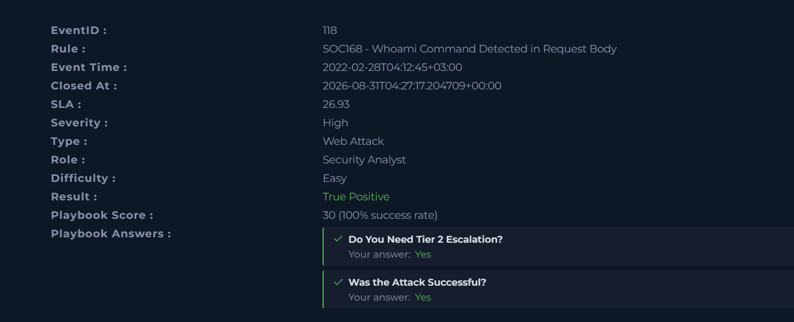
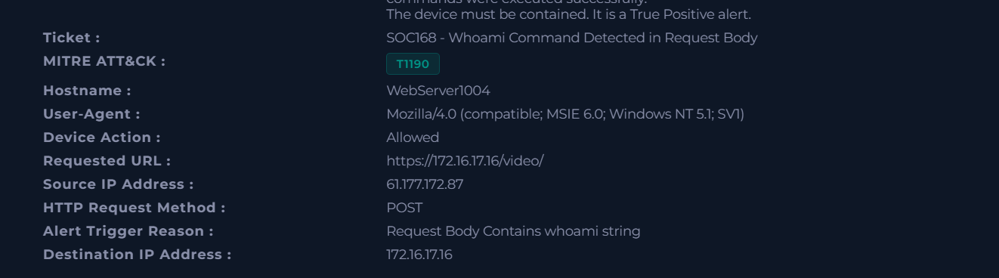
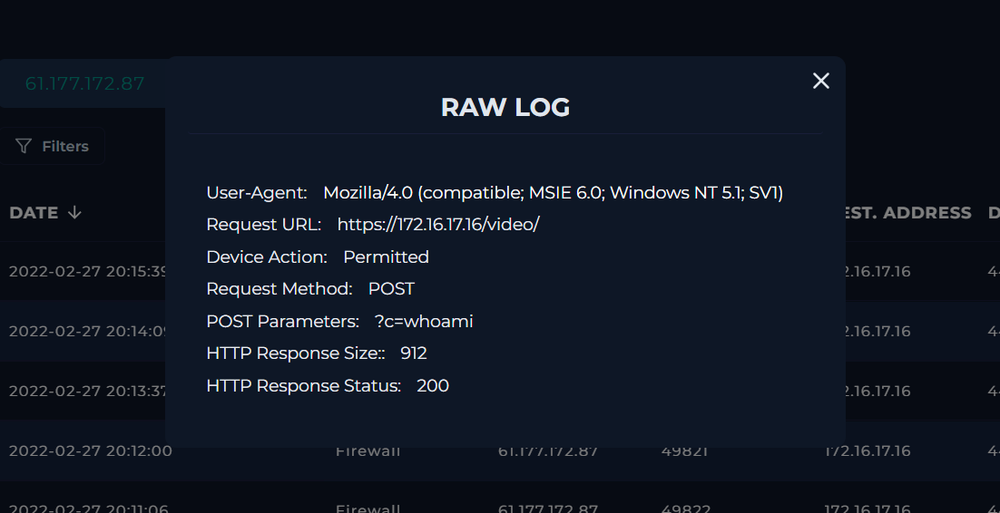
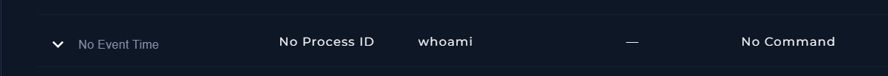
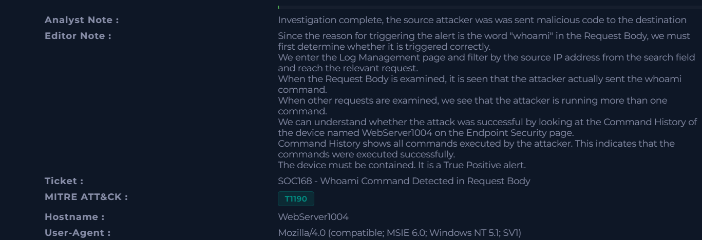

# Case #7 – Command Injection in Request Body Investigation

## Overview

This investigation involved a web attack alert triggered by a `whoami` command detected in the request body.

The investigation focused on determining whether the detected command was actually malicious, identifying the source and destination of the traffic, analyzing the request body, and verifying whether the command was successfully executed on the destination device.

The investigation confirmed a True Positive Command Injection attack and determined that the attack was successful.

## Alert Information

| Field | Value |
|---|---|
| Event ID | 118 |
| Rule | SOC168 - Whoami Command Detected in Request Body |
| Event Time | 2022-02-28 04:12:45 +03:00 |
| Severity | High |
| Alert Type | Web Attack |
| Hostname | WebServer1004 |
| Source IP | 61.177.172.87 |
| Destination IP | 172.16.17.16 |
| HTTP Method | POST |
| Device Action | Allowed |
| Requested URL | https://172.16.17.16/video/ |
| Alert Trigger Reason | Request Body Contains whoami string |
| Attack Type | Command Injection |
| Traffic | Malicious |
| Planned Test | Not Planned |
| Attack Successful | Yes |
| Tier 2 Escalation | Yes |
| Result | True Positive |
| MITRE ATT&CK | T1190 - Exploit Public-Facing Application |

## Investigation Process

### 1. Alert Analysis

The alert was reviewed after the SOC168 rule detected the `whoami` command in the request body.

The relevant request targeted the following endpoint:

`https://172.16.17.16/video/`

The request originated from:

`61.177.172.87`

and targeted:

`172.16.17.16`

The activity was classified as malicious and was determined not to be part of a planned security test.

### 2. Attack Classification

The activity was classified as a **Command Injection** attack.

The alert was triggered because the request body contained the `whoami` command.

The request details showed:

- HTTP Method: `POST`
- Device Action: `Permitted`
- Request URL: `https://172.16.17.16/video/`
- Source IP: `61.177.172.87`
- Destination IP: `172.16.17.16`

### 3. Request Analysis

The relevant raw log showed the following request parameter:

`?c=whoami`

The request returned:

- HTTP Response Status: `200`
- HTTP Response Size: `912`

The successful HTTP response and the presence of the `whoami` command in the request provided evidence that the command was processed by the destination application.

### 4. Command History Analysis

The Endpoint Security Command History for `WebServer1004` was examined to determine whether the commands were actually executed.

The command history showed:

`28.02.2022 04:12 - whoami`

`28.02.2022 04:13 - uname`

The presence of these commands in Command History confirmed that commands sent by the attacker were executed on the destination device.

Additional command activity was also identified during the investigation.

### 5. Attack Outcome

The investigation determined that the Command Injection attack was successful.

The evidence showed:

- A malicious request originating from `61.177.172.87`
- A `POST` request to `https://172.16.17.16/video/`
- The `whoami` command included in the request
- An HTTP `200` response
- `whoami` appearing in the device Command History
- `uname` also appearing in the Command History

Based on these findings, the incident was classified as a True Positive and required Tier 2 escalation.

## Analyst Assessment

The investigation confirmed a **True Positive Command Injection attack** against `WebServer1004` (`172.16.17.16`).

The attacker from `61.177.172.87` sent a POST request containing the `whoami` command to the `/video/` endpoint.

Log analysis confirmed the presence of the `whoami` command in the request. Endpoint Security Command History subsequently showed `whoami` and `uname` commands executed on the affected device.

The attack was determined to be successful. The device required containment and the incident was escalated to Tier 2.

## MITRE ATT&CK

The case was mapped to:

- **T1190 – Exploit Public-Facing Application**

## Key Indicators

| Type | Value |
|---|---|
| Source IP | `61.177.172.87` |
| Destination IP | `172.16.17.16` |
| Hostname | `WebServer1004` |
| Endpoint | `/video/` |
| HTTP Method | `POST` |
| Command | `whoami` |
| Additional Command | `uname` |
| HTTP Response Status | `200` |
| HTTP Response Size | `912` |
| Attack Type | Command Injection |
| MITRE ATT&CK | T1190 |

## Evidence

### 1. Initial Alert

### 2. Attack Details

### 3. Command Injection Request

### 4. Command History

### 5. Final Case Result

## Skills Demonstrated

- SIEM / Log Management investigation
- Command Injection analysis
- Web attack investigation
- HTTP request and response analysis
- Request body analysis
- Command History investigation
- Endpoint Security investigation
- IOC identification
- Incident classification
- MITRE ATT&CK mapping
- Tier 2 escalation decision-making
- Security incident documentation
