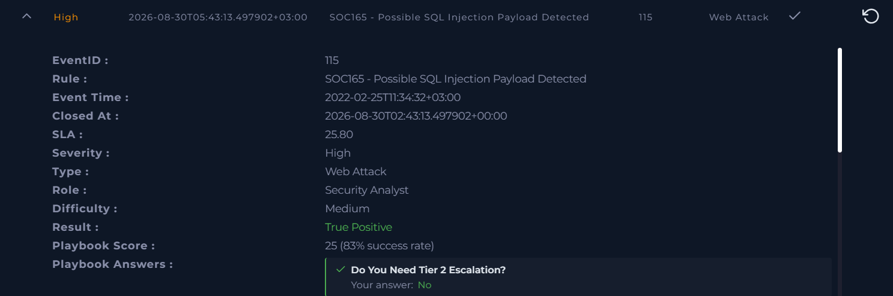
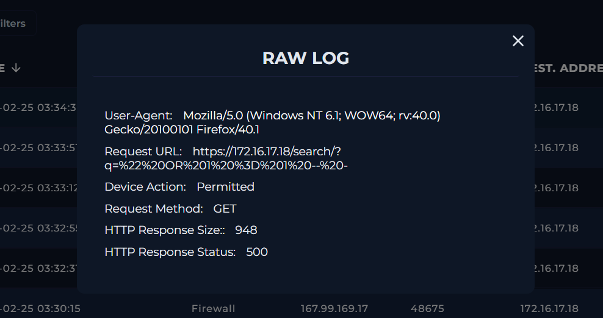
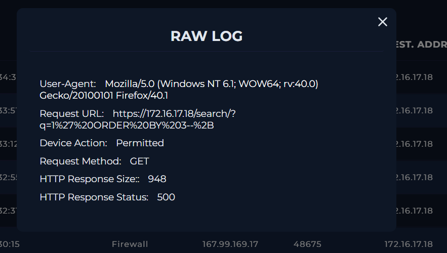
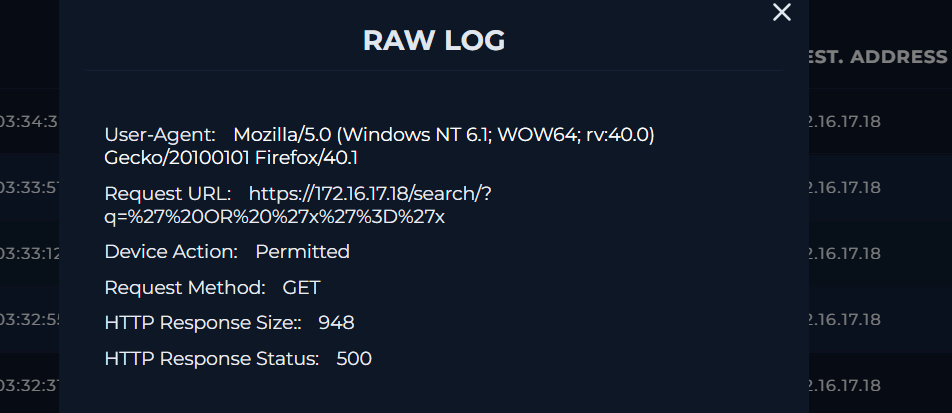

# Case #8 – SQL Injection Payload Investigation

## Overview

This investigation involved a web attack alert triggered by a possible SQL Injection payload detected in a requested URL.

The investigation focused on analyzing the requested URL, decoding the payload, reviewing related requests from the same source IP, and examining the HTTP response behavior to determine whether the SQL Injection attack was successful.

The investigation confirmed a True Positive SQL Injection attack attempt. The traffic was malicious, but the attack was determined to be unsuccessful.

## Alert Information

| Field | Value |
|---|---|
| Event ID | 115 |
| Rule | SOC165 - Possible SQL Injection Payload Detected |
| Event Time | 2022-02-25 11:34:32 +03:00 |
| Severity | High |
| Alert Type | Web Attack |
| Hostname | WebServer1001 |
| Source IP | 167.99.169.17 |
| Destination IP | 172.16.17.18 |
| HTTP Method | GET |
| Device Action | Allowed |
| Attack Type | SQL Injection |
| Traffic | Malicious |
| Planned Test | Not Planned |
| Attack Successful | No |
| Tier 2 Escalation | No |
| Result | True Positive |
| MITRE ATT&CK | T1190 - Exploit Public-Facing Application |

## Investigation Process

### 1. Alert Analysis

The alert was reviewed to determine why the SOC165 detection rule was triggered.

The alert identified a possible SQL Injection payload in the requested URL.

The relevant request targeted:

`https://172.16.17.18/search/`

The source IP associated with the activity was:

`167.99.169.17`

The destination IP was:

`172.16.17.18`

The traffic was classified as malicious and was determined not to be part of a planned security test.

### 2. SQL Injection Payload Analysis

The requested URL contained an encoded SQL Injection payload.

The observed request included:

`q=%22%20OR%201%20%3D%201%20-%20`

After URL decoding, the payload was identified as an SQL Injection attempt.

The alert was triggered because the requested URL contained an `OR 1=1` pattern.

### 3. Log Management Investigation

The source IP `167.99.169.17` was used to filter related requests in Log Management.

Multiple requests associated with the same source IP were identified.

The requests were related to the same SQL Injection vulnerability and targeted the same destination web server.

This confirmed that the activity was not an isolated alert and that the source was making multiple SQL Injection attempts.

### 4. HTTP Response Analysis

The HTTP responses for the related requests were examined.

The observed requests returned:

- HTTP Method: `GET`
- Device Action: `Permitted`
- HTTP Response Status: `500`
- HTTP Response Size: `948`

Multiple SQL Injection requests produced the same response behavior.

The repeated HTTP `500` responses and identical response sizes did not provide evidence of successful exploitation.

### 5. Attack Outcome

The investigation determined that the SQL Injection attack was unsuccessful.

The evidence showed:

- A malicious SQL Injection payload in the requested URL
- Multiple related requests from `167.99.169.17`
- Requests targeting `172.16.17.18`
- HTTP response status `500`
- Consistent response size of `948`
- No evidence of a successful SQL Injection response

The device was successfully contained.

## Analyst Assessment

The investigation confirmed a **True Positive SQL Injection attack attempt** against `WebServer1001` (`172.16.17.18`).

The attacker from `167.99.169.17` sent SQL Injection payloads through the search endpoint.

After decoding the requested URL, the payload was confirmed as SQL Injection activity.

Multiple related requests were identified from the same source IP. The requests consistently returned HTTP `500` responses with the same response size of `948`.

Based on the observed response behavior, the SQL Injection attack was determined to be unsuccessful.

## MITRE ATT&CK

The case was mapped to:

- **T1190 – Exploit Public-Facing Application**

## Key Indicators

| Type | Value |
|---|---|
| Source IP | `167.99.169.17` |
| Destination IP | `172.16.17.18` |
| Hostname | `WebServer1001` |
| Endpoint | `/search/` |
| HTTP Method | `GET` |
| Attack Type | SQL Injection |
| Payload Pattern | `OR 1=1` |
| HTTP Response Status | `500` |
| HTTP Response Size | `948` |
| Device Action | `Permitted` |
| Traffic Classification | `Malicious` |
| Attack Outcome | `Unsuccessful` |
| MITRE ATT&CK | `T1190` |

## Evidence

### 1. Initial Alert

### 2. Investigation Result

### 3. SQL Injection Details

### 4. Attack Indicators

### 5. Raw Log Evidence 1

### 6. Raw Log Evidence 2

### 7. Raw Log Evidence 3

### 8. Final Case Result

## Skills Demonstrated

- SIEM / Log Management investigation
- SQL Injection analysis
- Web attack investigation
- URL decoding and payload analysis
- HTTP request and response analysis
- Log correlation
- IOC identification
- Attack outcome determination
- False exploitation assessment
- Incident classification
- MITRE ATT&CK mapping
- Security incident documentation
