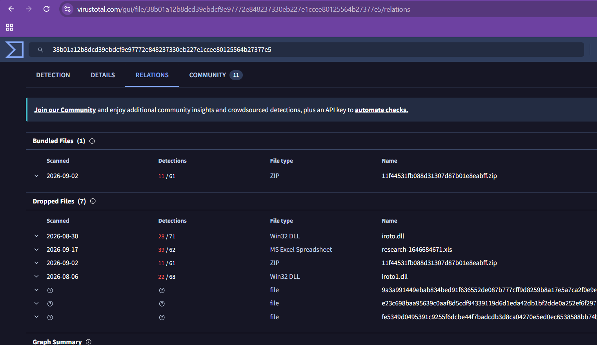
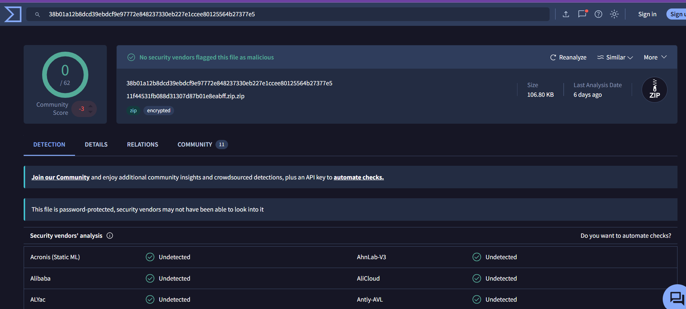

# Case #9 – Phishing Macro Investigation

## Alert Information

| Field | Details |
|---|---|
| **Case** | SOC46 |
| **Alert Name** | Phishing Mail Detected - Excel 4.0 Macros |
| **Event ID** | 93 |
| **Event Time** | 2021-06-13 14:13:28 +03:00 |
| **Severity** | High |
| **Category** | Exchange |
| **Verdict** | True Positive |
| **MITRE ATT&CK** | T1566 – Phishing |
| **Email Subject** | RE: Meeting Notes |
| **Source Email** | trenton@tritowncomputers.com |
| **Destination Email** | lars@letsdefend.io |
| **SMTP IP** | 24.213.228.54 |
| **Device Action** | Allowed |
| **Affected Host** | LarsPRD |

---

## Investigation Summary

This investigation involved a phishing email containing an Excel 4.0 macro attachment.

The attachment was analyzed during the investigation and determined to be harmful. The investigation identified malicious infrastructure and activity associated with the attachment.

Endpoint investigation of LarsPRD showed execution of the following command:

`regsvr32.exe -s ../iroto1.dll`

The command was observed twice on June 13, 2021, at approximately 14:20 and 14:21.

The investigation determined that the malicious Excel 4.0 macro executed the `regsvr32` command, providing evidence of malicious code execution on the affected endpoint.

The affected system was successfully contained.

---

## Investigation Process

### 1. Phishing Email Investigation

The alert was reviewed to identify the sender, recipient, subject, and malicious attachment.

The email was determined to contain a suspicious Excel attachment associated with the phishing alert.

### 2. Malware Analysis

The Excel attachment was analyzed as part of the investigation.

The investigation determined that the attachment was harmful and identified associated malicious infrastructure.

VirusTotal relationship information also showed files associated with the submitted archive, including dropped files that had security-vendor detections.

The parent ZIP shown in VirusTotal was password-protected and received a 0/62 detection result. Therefore, the VirusTotal screenshots are treated as supporting relationship/context evidence rather than direct proof that the encrypted parent ZIP itself was malicious.

### 3. Endpoint Investigation

The affected endpoint was identified as:

LarsPRD
172.16.17.57

Endpoint Terminal History showed execution of:

`regsvr32.exe -s ../iroto.dll`

and

`regsvr32.exe -s ../iroto1.dll`

The `regsvr32.exe` command associated with the Excel 4.0 macro was executed twice at approximately:

13.06.2021 14:20
13.06.2021 14:21

This provided direct endpoint evidence of command execution associated with the malicious macro activity.

---

## Key Findings

- A phishing email containing an Excel 4.0 macro attachment triggered the alert.
- The attachment was determined to be harmful during the investigation.
- The affected endpoint was LarsPRD.
- Malicious activity was associated with the endpoint after the attachment was opened.
- `regsvr32.exe` execution was observed on LarsPRD.
- The command was executed twice.
- VirusTotal relationship data showed associated dropped files with security-vendor detections.
- The incident was classified as a True Positive.
- The affected system was successfully contained.

---

## Indicators of Compromise

| Type | Indicator |
|---|---|
| **Source Email** | trenton@tritowncomputers.com |
| **Destination Email** | lars@letsdefend.io |
| **SMTP IP** | 24.213.228.54 |
| **Affected Host** | LarsPRD |
| **Host IP** | 172.16.17.57 |
| **Executed Command** | `regsvr32.exe -s ../iroto.dll` |
| **Executed Command** | `regsvr32.exe -s ../iroto1.dll` |

---

## MITRE ATT&CK

### T1566 – Phishing

The incident originated from a phishing email containing an Excel 4.0 macro attachment.

The phishing email was used to deliver the malicious file to the targeted user.

---

## Evidence

### 1. VirusTotal Relations

Shows the relationship information for the submitted archive, including associated/dropped files and their security-vendor detection results.

### 2. VirusTotal Detection Analysis

Shows the VirusTotal analysis of the password-protected ZIP. The parent archive itself was not directly detected by the available vendors, and VirusTotal indicated that the password protection may have prevented vendors from inspecting its contents.

### 3. Endpoint Command History – regsvr32

Shows `regsvr32.exe` execution on the affected endpoint LarsPRD, including execution of the DLL associated with the Excel macro activity.

---

## Incident Classification

**True Positive – Phishing / Malicious Excel 4.0 Macro**

The alert was validated as a genuine phishing incident. Investigation identified malicious macro-related activity and execution of `regsvr32.exe` on the affected endpoint.

The endpoint was successfully contained to prevent further malicious activity.

---

## Analyst Takeaways

This investigation demonstrates several SOC analyst skills:

- Phishing email investigation
- Malicious attachment analysis
- Security alert validation
- VirusTotal analysis
- Endpoint investigation
- Command history analysis
- Identification of suspicious `regsvr32.exe` execution
- IOC identification
- Incident response
- Incident classification
- Endpoint containment
- MITRE ATT&CK mapping

---

## Skills Demonstrated

- SIEM / SOC Investigation
- Phishing Analysis
- Email Security Investigation
- Malware Analysis
- VirusTotal
- Endpoint Detection and Response
- Command History Analysis
- LOLBin Investigation
- IOC Identification
- Incident Response
- Alert Triage
- Incident Classification
- MITRE ATT&CK
- Endpoint Containment

---

## Conclusion

The investigation began with a high-severity phishing alert involving an Excel 4.0 macro attachment.

Analysis identified malicious activity associated with the attachment, and endpoint investigation confirmed execution of `regsvr32.exe` on LarsPRD. The command history provided direct evidence that the DLL associated with the macro activity was executed.

The incident was classified as a True Positive, and the affected endpoint was successfully contained.

This case demonstrates the importance of correlating phishing alerts, malware analysis, endpoint command history, and IOC information when investigating malicious document-based attacks.
