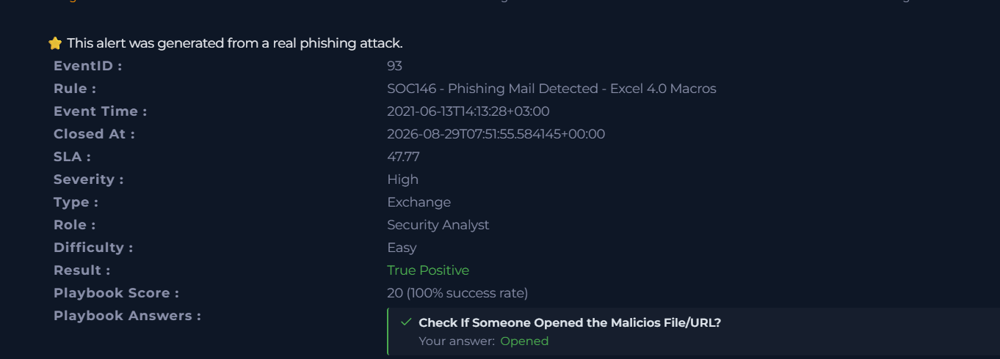
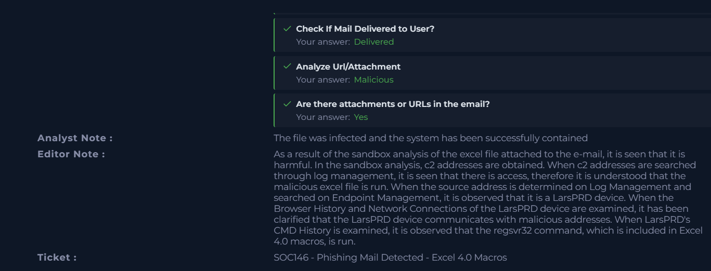
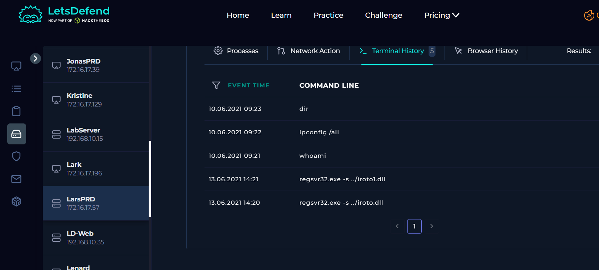

# Case #9 – Phishing Macro Investigation

## Alert Information

| Field | Details |
|---|---|
| **Case** | SOC46 |
| **Alert Name** | Phishing Mail Detected - Excel 4.0 Macros |
| **Event ID** | 93 |
| **Event Time** | 2021-06-13 14:13:28 +03:00 |
| **Severity** | High |
| **Type** | Exchange |
| **Role** | Security Analyst |
| **Difficulty** | Easy |
| **Result** | True Positive |
| **Playbook Score** | 20 (100% success rate) |
| **MITRE ATT&CK** | T1566 – Phishing |
| **SMTP Address** | 24.213.228.54 |
| **Device Action** | Allowed |
| **Email Subject** | RE: Meeting Notes |
| **Source Email** | trenton@tritowncomputers.com |
| **Destination Email** | lars@letsdefend.io |
| **Affected Host** | LarsPRD |
| **Host IP** | 172.16.17.57 |

---

## Investigation Summary

This investigation involved a high-severity phishing email containing an Excel 4.0 macro attachment.

The alert was confirmed as a **True Positive**. The playbook investigation established that the email was delivered to the user, the malicious file/URL was opened, and the attachment was determined to be malicious.

The LetsDefend investigation notes state that sandbox analysis of the Excel attachment identified the file as harmful and provided C2 addresses. Searching the C2 addresses through Log Management showed access associated with the malicious Excel file.

The source address was then investigated through Endpoint Management and identified as the **LarsPRD** device.

Further investigation of LarsPRD's Browser History and Network Connections showed communication with malicious addresses.

Finally, Terminal History on LarsPRD showed execution of the `regsvr32` command associated with the Excel 4.0 macro.

The affected system was successfully contained.

---

## Investigation Process

### 1. Alert Triage

The initial alert was reviewed to determine whether the phishing activity was genuine.

The alert identified:

- Event ID 93
- Rule: SOC46 - Phishing Mail Detected - Excel 4.0 Macros
- Severity: High
- Type: Exchange
- Result: True Positive
- MITRE ATT&CK: T1566
- Email Subject: RE: Meeting Notes
- Source: trenton@tritowncomputers.com
- Destination: lars@letsdefend.io

The playbook confirmed:

- The malicious file/URL was opened.
- The email was delivered to the user.
- The URL/attachment was malicious.
- The email contained an attachment or URL.

### 2. Malware / Attachment Investigation

The Excel attachment was analyzed through the LetsDefend sandbox.

According to the investigation notes, the sandbox analysis determined that the Excel file was harmful and identified C2 addresses associated with the malicious activity.

The C2 addresses were then searched through Log Management to determine whether the malicious Excel file had been accessed or executed.

### 3. Endpoint Identification

The source address identified during log investigation was searched through Endpoint Management.

The investigation identified the affected endpoint as:

LarsPRD

Host IP:

172.16.17.57

Further endpoint investigation was performed on LarsPRD.

### 4. Network and Host Activity

The investigation notes state that LarsPRD's Browser History and Network Connections were reviewed.

The investigation identified communication between LarsPRD and malicious addresses obtained during the sandbox analysis.

This provided additional evidence that the malicious Excel attachment was executed and that the endpoint communicated with malicious infrastructure.

### 5. Command History Investigation

Terminal History on LarsPRD was reviewed to identify commands executed after the malicious Excel attachment was opened.

The following command was observed:

`regsvr32.exe -s ../iroto1.dll`

The command was executed on 13.06.2021 at approximately 14:21.

A second related execution was also observed:

`regsvr32.exe -s ../iroto.dll`

at approximately 14:20.

The execution of `regsvr32.exe` was significant because the LetsDefend investigation notes specifically state that the `regsvr32` command included in the Excel 4.0 macro was run.

---

## Key Findings

- The alert was generated from a real phishing attack.
- The phishing email contained an Excel 4.0 macro attachment.
- The email was delivered to the targeted user.
- The malicious file was opened.
- Sandbox analysis identified the Excel attachment as harmful.
- C2 addresses were obtained during sandbox analysis.
- Log Management showed access associated with the malicious Excel file.
- The affected endpoint was identified as LarsPRD.
- LarsPRD communicated with malicious addresses.
- Terminal History showed execution of `regsvr32.exe`.
- The `regsvr32` command was executed twice.
- The incident was classified as a True Positive.
- The affected system was successfully contained.

---

## Indicators of Compromise

| Type | Indicator |
|---|---|
| **Source Email** | trenton@tritowncomputers.com |
| **Destination Email** | lars@letsdefend.io |
| **SMTP Address** | 24.213.228.54 |
| **Affected Host** | LarsPRD |
| **Host IP** | 172.16.17.57 |
| **Executed Command** | `regsvr32.exe -s ../iroto.dll` |
| **Executed Command** | `regsvr32.exe -s ../iroto1.dll` |

---

## MITRE ATT&CK

### T1566 – Phishing

The incident originated from a phishing email containing an Excel 4.0 macro attachment.

The phishing email was used to deliver the malicious file to the targeted user.

---

## Evidence

### 1. Initial Alert and Playbook

The initial alert identifies the incident as:

**SOC46 - Phishing Mail Detected - Excel 4.0 Macros**

The screenshot also shows the alert was classified as a **True Positive** with a playbook score of 20/20 and confirms that the malicious file/URL was opened, the email was delivered, and the attachment/URL was malicious.

### 2. Investigation Notes and IOC Details

This evidence shows the LetsDefend analyst and editor notes describing the sandbox analysis, harmful Excel file, C2 addresses, affected LarsPRD endpoint, malicious network communication, and execution of the `regsvr32` command.

The screenshot also contains the email and IOC information associated with the case.

### 3. Endpoint Command History

This screenshot shows Terminal History on LarsPRD and the execution of `regsvr32.exe` commands associated with the Excel 4.0 macro activity.

### 4. regsvr32 Execution Detail

This screenshot provides a closer view of the `regsvr32.exe` executions on LarsPRD, including the execution times and DLL paths.

---

## Incident Classification

**True Positive – Phishing / Malicious Excel 4.0 Macro**

The alert was validated as a genuine phishing incident.

The investigation identified a malicious Excel 4.0 macro attachment, malicious C2 infrastructure, communication from the affected endpoint, and execution of the `regsvr32` command associated with the macro.

The affected system was successfully contained.

---

## Analyst Takeaways

This investigation demonstrates the following SOC analyst skills:

- Phishing email investigation
- Security alert triage
- Malicious attachment analysis
- Sandbox analysis
- IOC identification
- C2 investigation
- Log Management investigation
- Endpoint investigation
- Network connection analysis
- Command history analysis
- `regsvr32` investigation
- Incident classification
- Endpoint containment
- MITRE ATT&CK mapping

---

## Skills Demonstrated

- SOC Alert Triage
- Phishing Analysis
- Email Security Investigation
- Malware Analysis
- Sandbox Analysis
- IOC Analysis
- C2 Investigation
- SIEM / Log Analysis
- Endpoint Detection and Response
- Network Investigation
- Command History Analysis
- LOLBin Investigation
- Incident Response
- Incident Classification
- MITRE ATT&CK
- Endpoint Containment

---

## Conclusion

The investigation began with a high-severity phishing alert involving an Excel 4.0 macro attachment.

The alert was confirmed as a True Positive. Sandbox analysis determined that the Excel attachment was harmful and identified C2 addresses associated with the malicious activity.

Log Management and Endpoint Management were then used to identify the affected endpoint as LarsPRD. Further endpoint investigation showed communication with malicious addresses.

Terminal History provided additional evidence by showing execution of `regsvr32.exe` commands associated with the Excel 4.0 macro.

The incident was successfully investigated and the affected system was contained.

This case demonstrates the importance of correlating email alerts, malware analysis, C2 infrastructure, endpoint activity, and command execution when investigating phishing attacks involving malicious Office documents.
